<div align="center">

# 👋 Hi, I'm Jay Joshi

### 🚀 Full Stack Developer | 🏆 Hackathon Winner | 💡 Problem Solver


[](https://portfolioo-1xkb.vercel.app/)
[](https://linkedin.com/in/jayjoshi2512)
[](https://github.com/jayjoshi2512)

</div>

---

## 🧑‍💻 About Me

```javascript
const jayJoshi = {
    location: "Gujarat, India",
    currentRole: "Full Stack Developer",
    specialties: ["MERN Stack", "Web Development", "AI/ML Integration"],
    achievements: ["🥇 Multiple Hackathon Winner", "🏆 SSIP Gujarat Finalist"],
    currentlyLearning: ["TypeScript", "Next.js", "Advanced React Patterns"],
    funFact: "I turn coffee into code and ideas into reality! ☕→💻",
    motto: "Building tomorrow's solutions, one line of code at a time"
};
```

<div align="center">

### 🎯 What I Do
**🔧 Build** full-stack applications • **🎨 Design** user-friendly interfaces • **🤖 Integrate** AI/ML solutions • **🏆 Win** hackathons

</div>

---

## 🛠️ Tech Arsenal

<div align="center">

### Frontend Mastery


### Backend Power


### Database & Cloud


### Mobile & Tools


</div>

---

## 🏆 Hackathon Achievements

<div align="center">

| 🏅 Position | 🎯 Event | 🏛️ Venue | 🎪 Status |
|-------------|----------|-----------|-----------|
| **🥉 3rd Place** | Hacker House GOA | GOA | **WINNER** |
| **🥇 1st Place** | Hackathon 2024 | B.H. Gardi College | **CHAMPION** |
| **✅ Finalist** | SSIP Hackathon | PDEU (State Level) | **SELECTED** |
| **🎯 Participated** | Hack The Mountains 5.0 | Marwadi University | **COMPETED** |
| **🎯 Participated** | HackNUthon 5.0 | Nirma University | **COMPETED** |


</div>

---

## 🌟 Featured Projects

<table align="center">
<tr>
<td width="50%" valign="top">

### 🎯 [Taskk - Productivity App](https://taskk-1-16pw.onrender.com/)
**A Notion-style minimalistic productivity platform**

🔹 **Tech Stack:** MERN + Shadcn/ui  
🔹 **Features:** Task management, JWT auth, Email integration  
🔹 **Highlights:** Clean UI, Secure backend, Scalable architecture  

[](https://taskk-1-16pw.onrender.com/)
[](https://github.com/jayjoshi2512/taskk)

</td>
<td width="50%" valign="top">

### 🏥 [Medi-Sense - Health Platform](https://github.com/jayjoshi2512/Medi-Sense)
**AI-powered unified health diagnostic platform**

🔹 **Tech Stack:** React + Flask + ML Models  
🔹 **Features:** 4 AI models, Brain tumor detection, Health predictions  
🔹 **Highlights:** CNN integration, Real-time analysis  

[](https://github.com/jayjoshi2512/Medi-Sense)

</td>
</tr>
<tr>
<td width="50%" valign="top">

### 📱 QrAttendify - Mobile & Web
**Complete attendance management ecosystem**

🔹 **Mobile:** Flutter + PHP + MySQL  
🔹 **Web:** React + Real-time dashboard  
🔹 **Features:** QR scanning, Live updates, Role-based access  

[](https://www.qrqr.miwtindia.com)

</td>
<td width="50%" valign="top">

### 🎓 Student Management System
**Role-based academic administration platform**

🔹 **Tech Stack:** PHP + MySQL + Bootstrap  
🔹 **Features:** Multi-role dashboards, Assignment management  
🔹 **Highlights:** Admin/HOD/Teacher/Student portals  

</td>
</tr>
</table>

---

## 📊 GitHub Analytics

<div align="center">


</div>

---

## 🎯 Current Focus

```mermaid
graph TD
    A[🎯 Current Goals] --> B[🔧 Advanced React Patterns]
    A --> C[⚡ Next.js Mastery]
    A --> D[🚀 TypeScript Deep Dive]
    A --> E[🤖 AI/ML Integration]
    A --> F[🏆 More Hackathon Wins]
```

<div align="center">



</div>

---

## 🌐 Let's Connect

<div align="center">

[](https://portfolioo-1xkb.vercel.app/)
[](https://linkedin.com/in/jayjoshi2512)
[](https://github.com/jayjoshi2512)
[](mailto:jay@example.com)

</div>

---

<div align="center">

### 💭 Quote That Drives Me

*"Code is like humor. When you have to explain it, it's bad."* – Cory House


**⭐ If you like my work, give it a star!**


</div>

---

<div align="center">

### 🔥 Fun Fact
```
while(alive) {
    eat();
    sleep();
    code();
    repeat();
}
```

**Thanks for visiting! Let's build something amazing together! 🚀**

</div>
